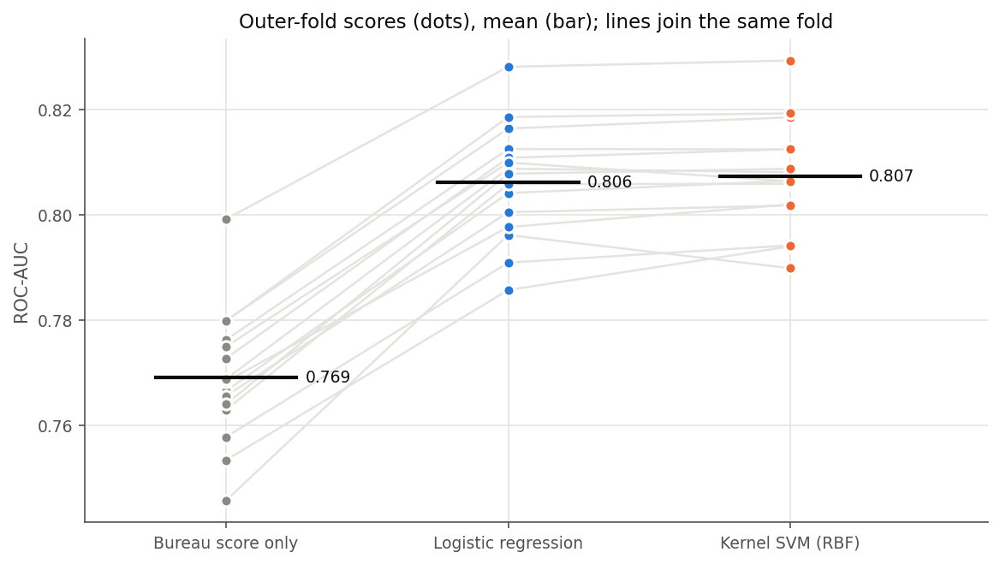
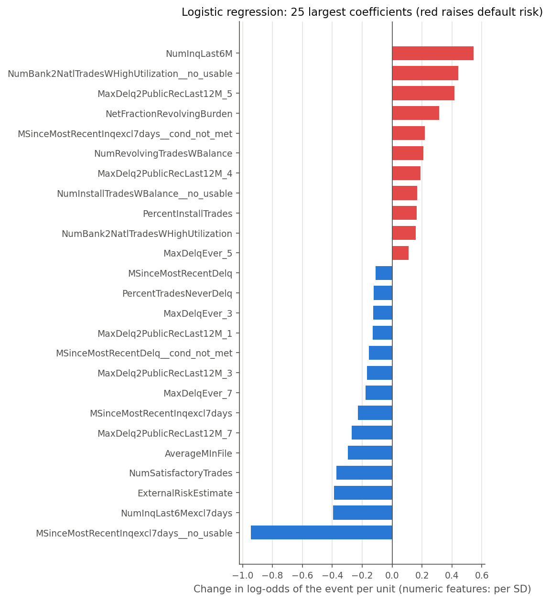
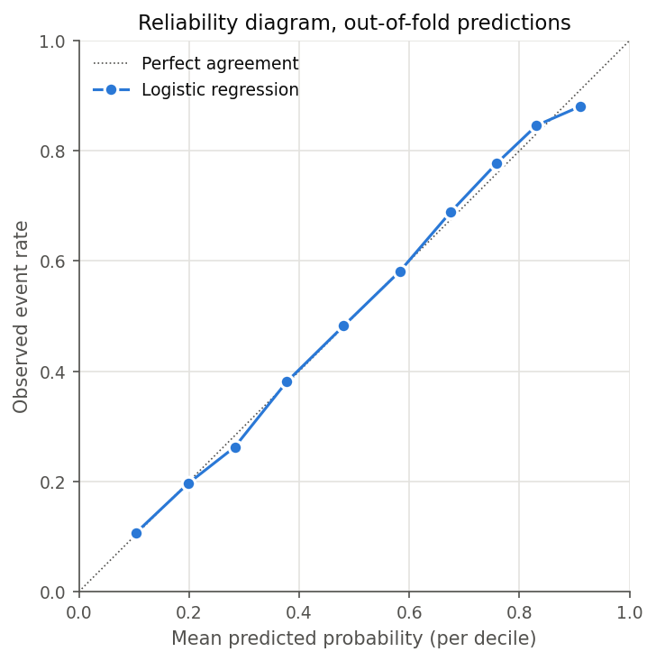

# HELOC credit risk: logistic regression versus kernel SVM

Predicting the probability that a home equity line of credit (HELOC)
applicant defaults, from credit bureau data. The project compares a
penalised logistic regression with a flexible nonlinear model, an RBF-kernel
support vector machine (SVM). It covers the full workflow:

- decoding a dataset whose missing values are hidden in special codes;
- exploratory analysis;
- nested cross-validation;
- interpreting and checking the final model.

## Questions and answers

| Question | Answer |
|---|---|
| How much does a model using all bureau attributes add to the bureau's own risk score? | ROC-AUC rises from 0.769 to 0.806. The gain is real, but the bureau score alone already achieves most of the discrimination. |
| Does a flexible nonlinear model (kernel SVM) predict better than logistic regression? | No. Both reach 0.806–0.807, and their scores differ by about 0.001 fold by fold. |
| Which characteristics drive predicted risk? | Recent credit-seeking and high revolving utilisation raise it; a higher bureau score, a longer credit history and more accounts in good standing lower it. |
| Are the predicted default probabilities reliable? | Yes. In every decile, predicted and observed default rates agree to within about 3 percentage points. |

**Recommended model: the logistic regression.** It predicts as well as the
SVM, is tuned in seconds rather than minutes, and yields both interpretable
coefficients and reliable probabilities.

## Contents

- [Data](#data)
- [Repository structure](#repository-structure)
- [Getting started](#getting-started)
- [Methodology](#methodology)
- [Results](#results)
- [Limitations](#limitations)

## Data

The dataset comes from the FICO Explainable Machine Learning Challenge (2018):
10,459 anonymised applications for a HELOC in the United States, each
described by 23 credit bureau attributes. The target, `RiskPerformance`,
records whether the applicant became 90 or more days past due within 24
months.

The data are **not included** in this repository. Download
`heloc_dataset_v1.csv` from
[Kaggle](https://www.kaggle.com/datasets/averkiyoliabev/home-equity-line-of-creditheloc)
and place it in `data/`. The original source, with the official data
dictionary, is the
[FICO community page](https://community.fico.com/s/explainable-machine-learning-challenge)
(registration required).

Column meanings, special codes and code tables are documented in
[`docs/data_dictionary.md`](docs/data_dictionary.md).

## Repository structure

```
heloc-credit-risk/
├── data/                         raw data (not tracked, see above)
├── docs/
│   └── data_dictionary.md        columns, special codes, code tables, sources
├── reports/
│   ├── figures/                  figures 03-06 (EDA) and 07-11 (models)
│   └── *.csv                     result tables written by model.py
├── src/
│   ├── prepare_data.py           decoding and cleaning; load_clean_data()
│   ├── eda_utils.py              reusable EDA functions
│   ├── eda.py                    exploratory analysis of this dataset
│   ├── model_utils.py            reusable modelling functions
│   └── model.py                  model comparison and interpretation
├── requirements.txt
└── README.md
```

The `*_utils.py` modules are generic: nothing in them refers to this dataset,
and they can be reused for other binary classification problems.

## Getting started

**Requirements.** Python 3.11 or later, and the packages pinned in
[`requirements.txt`](requirements.txt).

```bash
git clone https://github.com/dcl3rc/heloc-credit-risk.git
cd heloc-credit-risk
python -m venv .venv
source .venv/bin/activate          # Windows: .venv\Scripts\activate
pip install -r requirements.txt
```

Then download the data into `data/` as described above.

**Running the analysis** from the repository root:

| Command | What it does | Runtime |
|---|---|---|
| `python src/prepare_data.py` | Prints the inspection and cleaning report | seconds |
| `python src/eda.py` | Exploratory analysis; figures 03-06 | seconds |
| `python src/model.py` | Model comparison and interpretation; tables and figures 07-11 | about 16 minutes on 2 CPU cores, faster with more |

To check the pipeline quickly, set `QUICK = True` at the top of `model.py`:
it runs on a 2,000-row subsample in under a minute. All splits use fixed
random seeds, so every run reproduces the same numbers.

## Methodology

### 1. Data preparation

The raw file contains no empty cells: missing information is encoded as
negative integers with distinct meanings.

| Code | Meaning | Treatment |
|---|---|---|
| −9 | No bureau record | Rows with −9 on every attribute (588) are dropped; isolated cells become missing |
| −8 | No usable trades or inquiries | Missing |
| −7 | Condition not met (e.g. never delinquent) | Missing |

Before a code is replaced by a missing value, it is recorded in its own
**indicator column**, one per (variable, code) pair that occurs: 12 in all.
This keeps the information the codes carry, and that information differs
between columns. An applicant flagged −7 in the delinquency column (never
delinquent) defaults less often than average; an applicant flagged −7 in the
inquiry column defaults more often. One exact duplicate record is also
removed, leaving 9,870 applications. The two delinquency status columns hold
category codes rather than quantities and are typed as categorical.

### 2. Exploratory analysis

The analysis looks at six things:

- the default rate (52.0%, near-balanced);
- how the default rate changes when a value is missing, for each special code;
- the distribution of each feature;
- the default rate across the range of each feature, and each feature's
  predictive power used alone;
- the default rate for each delinquency status code;
- the correlations between features.

Two findings shaped the modelling. Most features relate to default in a
steady, one-directional way, which a linear model captures well. And the
bureau risk score is by far the strongest single feature (AUC 0.769 used
alone).

### 3. Modelling

- **Preprocessing inside the pipeline.** Median imputation, standardisation
  and one-hot encoding are fitted on the training part of each fold only, so
  no information from test data leaks into them. The indicator columns let
  the model give each kind of missing value its own effect.
- **Models.**
  - L2-penalised logistic regression, tuned over the penalty `C`.
  - RBF-kernel SVM, tuned over `C` and the kernel parameter `γ`.
  - A one-variable logistic regression on the bureau score, as the reference.
- **Nested cross-validation.** An outer stratified 5-fold split, repeated
  three times (15 folds), estimates performance. An inner 3-fold split within
  each outer training set selects the hyperparameters, so the reported scores
  are not inflated by the tuning. All models use the same outer folds, so they
  can be compared fold by fold.

**Model specifications.** The logistic regression models the log-odds of
default as linear in the preprocessed features `z`:

$$\log\frac{P(\text{default}\mid z)}{1 - P(\text{default}\mid z)} = \beta_0 + \beta^\top z,$$

estimated by minimising the log loss plus an L2 penalty
$\lVert\beta\rVert^2/(2C)$. The SVM classifies by the sign of
$f(z) = \sum_i \alpha_i y_i \exp(-\gamma\lVert z - z_i\rVert^2) + b$, with $y_i = \pm 1$, where the
sum runs over the training applicants that define the boundary (the support
vectors). Its output `f(z)` ranks applicants but is not a probability.

## Results

### Model comparison

| Model | ROC-AUC (mean ± sd, 15 folds) | Accuracy | Log loss |
|---|---|---|---|
| Bureau risk score alone | 0.769 ± 0.013 | 0.707 | 0.577 |
| **Logistic regression** | **0.806 ± 0.011** | 0.739 | 0.539 |
| Kernel SVM (RBF) | 0.807 ± 0.010 | 0.738 | n/a |



Each line joins one fold across the three models:

- **From the bureau score to logistic regression**, the lines rise on every
  fold: the full model is consistently better.
- **From logistic regression to the SVM**, the lines are almost flat: on
  every fold the two score nearly the same. The SVM is marginally higher on
  11 of 15 folds, but the mean difference is 0.001, small against the 0.011
  spread between folds.

**Why the SVM brings nothing.** In 14 of 15 folds the hyperparameter search
chose a small `γ` (10⁻³ or 10⁻⁴), that is, a very wide kernel. With a wide kernel the SVM's
boundary is nearly linear, so it ends up behaving like a linear model. This
agrees with the exploratory finding that most relationships with default are
steady and one-directional.

### What drives predicted risk



Coefficients are changes in the log-odds of default per standard deviation
(numeric features) or for the presence of a code (indicators and categories).
Red raises risk; blue lowers it.

- **Credit-seeking.** Having no usable inquiry record is the strongest single
  effect, multiplying the odds of default by 0.39. More recent inquiries
  raise risk.
- **Utilisation.** High revolving utilisation and many accounts near their
  limit raise risk.
- **Track record.** A higher bureau score, a longer credit history and more
  accounts in good standing lower risk.

Correlated features share their effects, so coefficients should be read by
group. `NumInqLast6M` has a positive coefficient and `NumInqLast6Mexcl7days`
a negative one. Since the two counts are nearly identical, together they
effectively measure inquiries made in the last seven days, a sign of urgent
credit-seeking.

### Reliability of the probabilities



Across the ten deciles of predicted probability, the observed default rate
tracks the predicted one closely, from 0.10 predicted against 0.11 observed
to 0.91 against 0.88. The Brier score is 0.179, against 0.250 for a model
that always predicts the average default rate. The logistic regression's
outputs can therefore be read as default probabilities. The SVM produces
scores, not probabilities, so this check does not apply to it.

## Limitations

- **Unrepresentative default rate.** The sample default rate (52%) reflects
  how the dataset was built and is far above that of a real lending
  portfolio. The probabilities are reliable *for this sample*; for a
  population with a different default rate, they would need adjusting.
- **Default decision rule.** Accuracy and the confusion matrices use each
  model's default rule (reject if the predicted probability exceeds 0.5). In
  practice a lender would set the threshold from the relative costs of
  approving a defaulter and rejecting a good applicant.
- **Cross-sectional data.** The applications carry no dates, so stability
  over time or under changing economic conditions cannot be assessed.
- **Column definitions.** Some descriptions in the data dictionary are
  inferred from column names and standard bureau conventions. The data
  dictionary states which descriptions are verified.
- **Scope.** Gradient-boosted trees, the usual strongest baseline on tabular
  data, were not included in the comparison.

## Author

Dylan Clerc · [@dcl3rc](https://github.com/dcl3rc)
